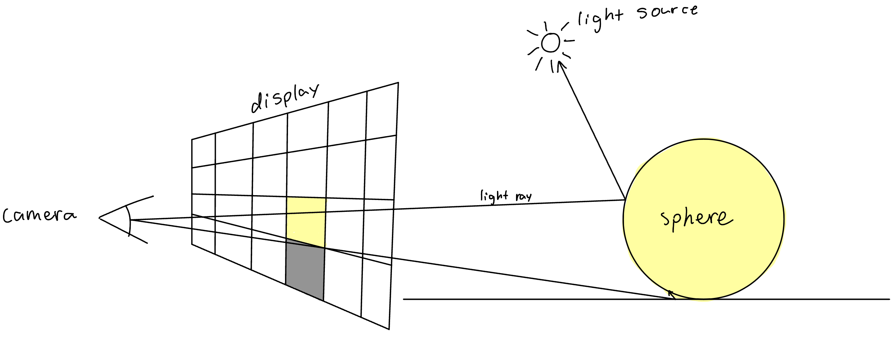

# Go Raytracer


## Description
This is a raytracer written in Golang using [this book](https://gabrielgambetta.com/computer-graphics-from-scratch/) as a guide. This program uses a parallel algorithm that utilizes Go's concurrency model. The user describes the scene in `main.go`, which is then rendered. In its current state, the program will make the camera move backward a small amount each frame.

## Future Plans
I plan to improve this project in the future by implementing pathtracing, other materials and geometry, textures, and GPU rendering. 

## How to Run
In `main.go`, you can specify the parameters of the camera, objects, and other attributes of the scene. You can specify where the frames of the animation are put as well. By default, the program renders three reflective balls on a plane. To run the program, run
```
$ go run main.go
```

## Example
```
$ go run main.go
```
 (gif created using ImageMagick: `convert *.png(n) showcase.gif`)